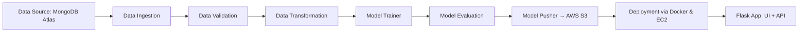

# 🚗 Vehicle Data MLops Project  

<p align="center">
  
  
  
  
  
  
  
  
</p>  

A complete **end-to-end MLops pipeline** demonstrating how to build, deploy, and scale machine learning solutions with modern practices like **data ingestion, validation, transformation, training, evaluation, deployment, CI/CD, and cloud integration**.  

This project integrates **MongoDB Atlas, AWS S3, Docker, GitHub Actions, and EC2**, following best practices in **logging, exception handling, modular code, and pipeline automation**.  
It is designed to **impress recruiters** and showcase my MLops engineering skills.  

---

## 🌟 Features & Highlights  

- 🔹 **Project Automation**: Template-driven project initialization  
- 🔹 **Environment Management**: Conda + `requirements.txt` for reproducibility  
- 🔹 **MongoDB Atlas Integration**: Cloud-based dataset ingestion and exploration  
- 🔹 **Data Pipeline**: Modular design with **Ingestion → Validation → Transformation → Training → Evaluation → Pusher**  
- 🔹 **AWS Integration**: S3 storage, IAM roles, EC2 deployment, ECR image registry  
- 🔹 **Logging & Exception Handling**: Centralized monitoring and debugging utilities  
- 🔹 **CI/CD Workflow**: GitHub Actions + Self-hosted Runner on EC2  
- 🔹 **Containerization**: Docker for consistent builds and deployments  
- 🔹 **Web App Deployment**: Flask app served on EC2 (port `5080`)  

---

## 📂 Project Structure  

```

vehicle-mlops/
│── src/
│   ├── components/            # Data ingestion, validation, transformation, training
│   ├── configuration/         # MongoDB & AWS connections
│   ├── data\_access/           # MongoDB → Pandas/DataFrames
│   ├── entity/                # Config & Artifact classes
│   ├── aws\_storage/           # S3 utilities
│   ├── utils/                 # Helper & main utility functions
│   ├── logger.py              # Centralized logging
│   ├── exception.py           # Custom exception handling
│
│── notebooks/                 # EDA, Feature Engineering, MongoDB demos
│── static/                    # Frontend assets
│── templates/                 # Web UI templates
│── requirements.txt
│── setup.py
│── pyproject.toml
│── Dockerfile
│── .dockerignore
│── .github/workflows/aws.yaml
│── app.py                     # Flask prediction pipeline
│── template.py                 # Project bootstrap script

````

---

## ⚙️ Setup Instructions  

### 🔧 1. Environment Setup  
```bash
conda create -n vehicle python=3.10 -y
conda activate vehicle
pip install -r requirements.txt
pip list   # confirm local packages installed
````

### 🗄️ 2. MongoDB Atlas Setup

1. Create free cluster (M0) on MongoDB Atlas
2. Add DB user & whitelist IP (`0.0.0.0/0`)
3. Copy Python connection string
4. Load dataset via Jupyter Notebook → Verify data in Atlas

### 📝 3. Logging & Exceptions

* `logger.py` → For consistent logs
* `exception.py` → Centralized error handling

### 📊 4. Data Pipeline Components

* **Ingestion** → Load data from MongoDB → DataFrame
* **Validation** → Schema checks via `schema.yaml`
* **Transformation** → Feature engineering & preprocessing
* **Training** → Model building & persistence
* **Evaluation** → Compare with threshold score (0.02)
* **Pusher** → Upload best model to AWS S3 registry

### ☁️ 5. AWS Setup

* IAM Users for S3 & CI/CD
* S3 Bucket: `my-model-mlopsproj`
* ECR Repository: `vehicleproj`
* EC2 Ubuntu Instance (deployment server)

### 🐳 6. Docker & CI/CD

* **Docker** → Build containerized app
* **GitHub Actions** → Automated pipeline → Builds & deploys to EC2 self-hosted runner
* **Secrets** → `AWS_ACCESS_KEY_ID`, `AWS_SECRET_ACCESS_KEY`, `ECR_REPO`

### 🌐 7. Web App

* Flask app (`app.py`) with endpoints:

  * `/` → Prediction UI
  * `/training` → Trigger model training
* Accessible at:

  ```
  http://<EC2_PUBLIC_IP>:5080
  ```

---

## 🚀 Tech Stack

| Layer             | Tools & Services                   |
| ----------------- | ---------------------------------- |
| **Data Storage**  | MongoDB Atlas                      |
| **Orchestration** | Python, Conda, Modular OOP Design  |
| **Cloud**         | AWS S3, ECR, EC2                   |
| **CI/CD**         | GitHub Actions, Self-hosted Runner |
| **Deployment**    | Docker, Flask                      |
| **Monitoring**    | Logging & Exception Handling       |
| **Versioning**    | Git, GitHub                        |

---

## 📈 Workflow Overview



---

## 🏆 Key Takeaways

✅ Hands-on experience with **end-to-end MLops pipeline**
✅ Proficiency in **AWS, Docker, GitHub Actions, MongoDB**
✅ Showcases ability to **productionize ML models**
✅ Highlights **CI/CD automation & cloud deployment**

---

## 🤝 Connect

👤 **Author**: Ayush Jha
📍 B.Tech IT @ KNIT Sultanpur
💻 Interests: Competitive Programming | Development | MLops | ML Engineering


